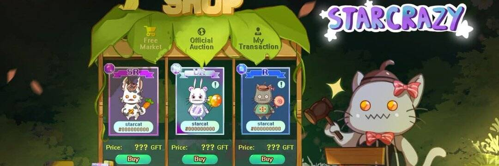

# StarCrazy

什么是星狂？
StarCrazy 是基于 IoTeX 平台构建的最新区块链 Play-to-Earn 游戏。 IoTeX 具有 5 秒的交易最终性和几分之一美分的交易成本。这使得 StarCrazy 成为在线游戏市场上对玩家更友好的“玩赚钱”游戏之一。
玩家买卖 Starz (NFT)，并可以将它们融合在一起，以获得创造更有价值角色的机会。将您的 Starz 分配给我，以赚取 GFT 或 GFS 代币。您还可以将您的 GFT 代币投入流动资金池，以获得另一种赚钱方式。
GFT 是 Play-to-Earn 游戏 StarCrazy 的实用代币。 StarCrazy 中的所有拍卖、交易和融合活动均使用 GFT 进行。这也适用于即将到来的“竞技场战斗”和社交互动功能。
StarCrazy 的代币经济学非常以玩家为中心。玩家使用 GFS 治理令牌控制游戏中的方向。 100% 的 GFS 代币由玩家赚取。没有一个是团队拥有的。
$GFT 和 $GFS 的总代币供应量上限为 3000 万。

