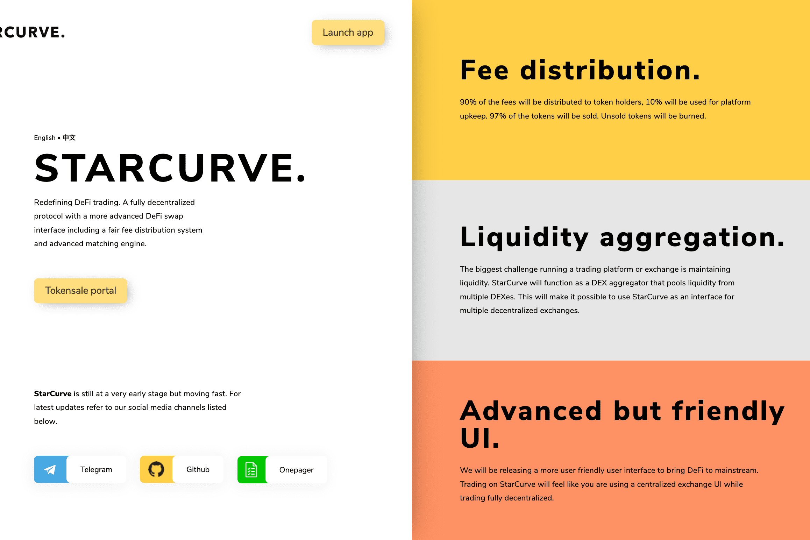

# StarCurve

StarCurve 是一个完全去中心化的协议，具有更先进的 DeFi 交换接口，包括公平的费用分配系统和先进的匹配引擎。
我们的目标是为去中心化交易创建一个更加用户友好和改进的 UI 和匹配引擎。随着 DeFi 和去中心化交易所（如 Uniswap）的普及，创始团队得出结论，去中心化交易所的现状及其程序过于复杂，对用户不友好。 StarCurve 希望提高 DeFi 交易协议和去中心化生态系统的采用率。
Gnosis 协议销售
我们将使用 Gnosis 协议通过联合曲线促进我们的代币销售。我们的 UI 是 Gnosis DEX 的定制版本，直接与经过验证的 Gnosis 合约交互。我们将很快发布有关代币销售流程的更多信息。

费用分配
与一些去中心化交易所不同，StarCurve 将对通过该平台进行的交易收取费用。这笔费用将用于奖励代币持有者并获得平台维护和改进的收入。
用户界面改进
尽管有许多用于去中心化交易的最先进的智能合约和后端解决方案，但在我们看来，大多数应用程序的前端的优先级较低。对于 StarCurve 来说，前端是平台的重要组成部分，因为我们的目标是将 DeFi 带入主流。
流动性聚合器
运行交易平台或交易所的最大挑战是保持流动性。 StarCurve 将充当 DEX 聚合器，汇集来自多个 DEX 的流动性。这将使使用 StarCurve 作为多个去中心化交易所的接口成为可能。

