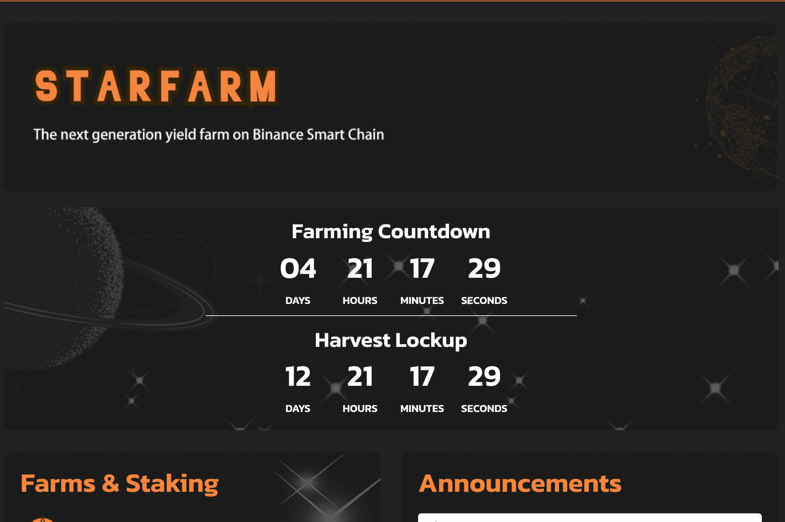

# StarFarm Finance

StarFarm 是运行在币安智能链上的最新一代 Yield Farm 和 AMM 去中心化交易所，具有许多独特和创造性的功能。我们的灵感来自长期的收获锁定，但我们可以更好地进行收获锁定。

保险库是 STARFARM Finance 区别于其他 AMM 的一个基本特征。 保险库管理农场的所有存入资产，保险库的收益用于回购和销毁 $STAR 以增加 StarFarm Finance 的流动性。 智能合约使用 60% 的每日收入来自动增加流动性。 StarFarm Finance 还建立了自动销毁机制，每日收益的 40% 用于回购和销毁其原生代币 $STAR。

