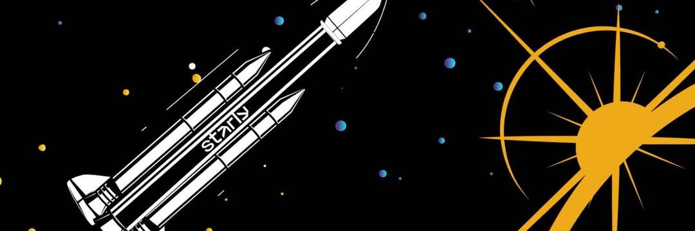

# Starly

Starly 是为围绕其游戏化 NFT 收藏建立经济的创作者提供的空间。Starly 通过将 NFT 随机组织在具有三种不同稀有等级的密封包中，为收集 NFT 带来了真正的价值。 每个收藏都包含一组 21 张卡片——11 张普通卡片、6 张稀有卡片和 4 张传奇卡片，是终极收藏游戏的完美公式。收藏家在市场上买卖他们的卡片以完成全套卡片。 顶级收藏家会因在此过程中达到某些收藏里程碑而获得创作者的奖励。 这种参与是将他们的关系提升到一个新水平的主要驱动力。

