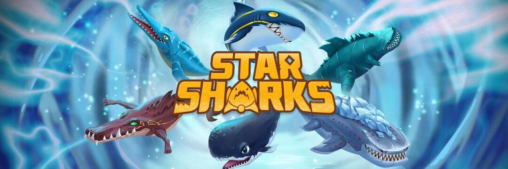

# StarSharks

Star Sharks 是一个社区驱动的游戏平台，玩家、开发者和投资者可以在其中定义可持续生态系统中底层 NFT 的价值演变。 该项目旨在培养和与社区分享内容的价值，并颠覆当前一个游戏中资产孤立的市场。 它使玩家能够聚集在一起建立和管理一个新的元宇宙，并在鲨鱼元宇宙中创造一种社区文化。 Star Sharks 由一个团队于 2021 年创立，该团队之前曾有来自谷歌和币安的明星表演者。

