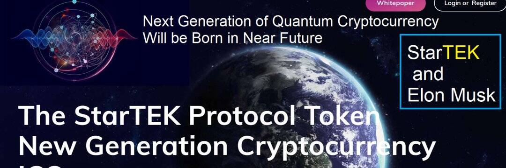

# StarTEK Protocol

StarTEK 是基于技术支持知识 (TEK) 的新一代平台，支持视频游戏等各个领域的新创新创业项目。 StarTEK 团队将在不久的将来与 Dogecoin Group 和 Elon Musk 合作创建下一代加密货币（量子系统）。这个重要的项目，目前在 Zahlex GmbH 公司的支持下，正在 StarTEK 协议团队中进行准备。我们需要您的帮助来通过推文和合作开发我们的项目。至此，项目的第一阶段已经进行，项目的初始shell已经在MATLAB编程语言平台（Integrating Python and MATLAB）下实现。
StarTEK 集团正在吸引投资者和初创代币持有者，并打算到 2022 年实现以下目标：

1. 新一代加密货币（量子系统）的创建。
2. 调用 MATLAB 对比特币的预测分析。
3. 为研究人员和科学家建立科学 NFT 商店。
4、支持和发展电脑游戏领域的新创企业。

