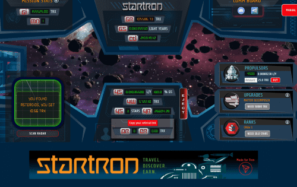

# STARTRON

使命 - 一个神秘的频率在整个宇宙中产生共鸣。 一个多维虫洞等待发现。 竞赛 - 星际飞船指挥官相互竞争，成为第一个发现虫洞确切位置的人。 升级 - 你需要速度。 升级您的推进系统以达到超高速并击败竞争对手。 LOCATE - 找到坐标？ 进入门户，成就永恒的荣耀。 EARN - 通过加入太空任务，您将获得版税、奖品和推荐佣金。

该数据代表被跟踪智能合约的原始链上活动

