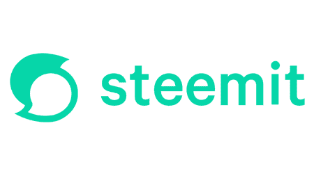

# Steemit

Steemit 通过建立一个活生生的、呼吸的和不断发展的社会经济重新定义了社交媒体——一个用户因分享他们的声音而获得奖励的社区。 这是一种新型的注意力经济。

Steemit 是一个基于区块链的博客和社交媒体网站。用户可以获得加密货币 STEEM，用于发布和策划内容。该公司由 Steemit Inc. 所有，这是一家位于纽约市的私人控股公司，总部位于弗吉尼亚州。

工作原理
Steemit 被设计为基于 Steem 区块链的去中心化应用程序 (DApp)，使用同名加密货币 STEEM 来奖励用户的内容。[2][3][4]通过对帖子和评论进行投票，用户可以决定这些帖子的支出。用户还可以获得所谓的“策展奖励”，用于查找和点赞之后被其他用户点赞的内容。

