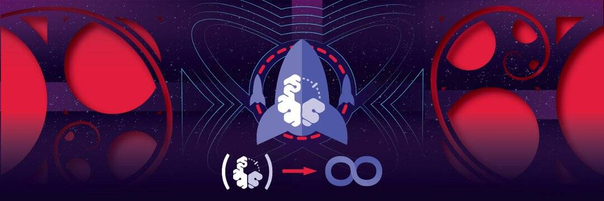

# STEMsocial

STEMsocial 项目于三年多前启动，旨在在 Hive 上建立一个对科学、技术、工程和数学 (STEM) 领域感兴趣的人们的社区。

我们认为，让 Hive 成为 STEM 更好的地方对于整个平台的长期发展至关重要，使其不仅可以对优质、有趣和前沿的 STEM 内容友好，而且成为真正的平台。 科学传播，同时激发和启发社区内外的思想。

在 Hive 区块链上促进科学、技术、工程和数学。 加入我们的内容创作者社区，赚取您的份额！

