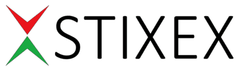

# STIXEX

STIXEX 平台允许用户对价格图表中下一个烛台的颜色下注，并在获胜交易中赚取 80% 的利润。 您所要做的就是选择红色或绿色！

### STIXEX是什么？

STIXEX于2018年发布， 是唯一允许用户蜡烛图中投注下一个蜡烛颜色的平台。玩家将获得简单的二进制选择，可选红色或绿色蜡烛。要了解有关如何使用我们平台的更多信息，请访问 “如何开始”页面。

### 我可以在STIXEX赢多少钱？

无论加密资产的价格变动了多少，所有的中奖赌注都将获得80%的派彩。即使价格在您选择的方向上只移动了几分之一美分，一旦您押注成功，您也将获得80%的利润。例如，如果您下注了1USDT，如果您交易成功，也就是说押对了K线颜色，您将得到1.8USDT，但如果您的交易不成功，也就是K线颜色没选对，您将失去您最初的1USDT。如果结果中立，您将收到您最初的下注金额。

### 下注时是否需要支付交易费用？

否，仅在链上处理存款和提款，并产生gas费。另一方面，所有投注都是在链外进行的，用户无需支付gas费。

### 在STIXEX交易的费用是多少？

目前，该平台没有其他费用。

### 我需要开设帐户吗？

不。您的 Metamask 帐户是您的STIXEX帐户。只需安装Metamask扩展程序，即可开始投注。如果您对此部分有更多疑问，请加入我们的电报群，询问更多信息。

### 我可以用移动设备在STIXEX下注吗?

可以。您只需转到Google Play Store并使用内置钱包安装Metamask移动浏览器应用程序即可。这款钱包/浏览器应用程序允许您存储您的加密货币并访问STIXEX等应用程序。为了获得最佳的用户体验，我们建议使用带有Metamask扩展程序的电脑。如果您需要有关移动浏览器应用的帮助或有任何疑问，请通过我们的电报频道向我们咨询。

