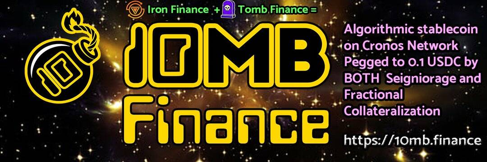

# Stone Temple Binance

石庙币安将成为币安智能链上唯一用户拥有的区块链平台！ 所有平台收入要么作为红利分配给所有权代币质押者，要么为收益代币提供 AMM 支持。 该平台的 dApps 包括场外交易 (OTC) 交易引擎、NFT 质押和 Lootbox “卡包”游戏，其中包括一台老虎机进行审计和扑克，以及即将推出的完整游戏！

10mb Finance 是第一个使用铸币税和分数抵押作为挂钩执行机制的算法稳定币。 仅在 Cronos 网络上！

