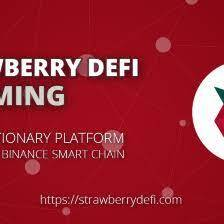

# Strawberry DeFi

功能 独特的燃烧机制 我们正在尝试创建一个强大的燃烧机制，不断提高代币的价格。投注时有 2% 的销毁费（当前费率） 记录交易费（2% 的 50%）将用于购买 SWB 并记录 Earn Safety
Strawberry DeFi 是由币安智能链和 Pancake Swap 交易所提供支持的去中心化交易所，具有让您赚取和赢取代币的功能。我们正在尝试做的是创建一个永久通缩代币 SWB，它允许通过足够的销毁机制实现持续的价格通胀。我们不是试图取代掉期和交换，而是希望为系统增加价值，并为人们创造一个合适且可持续的环境来生产高年利率的农场。
我们希望创建 SWB，让每个人都可以耕种！投注时赚取 SWB 和其他硬币（待定）。
Timelock 在启动时添加到合约中删除了迁移器代码（继承自 Pancake swap）

