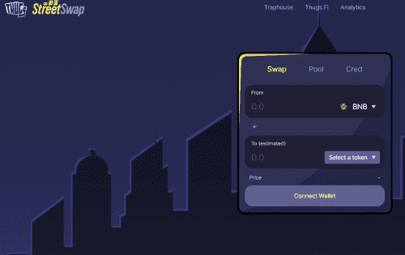

# StreetSwap

StreetSwap 是 Thugs.fi 项目的 AMM 分支。 来 StreetSwap 满足您的所有交易需求。 为任何代币对提供流动性，以获得链上的一些最佳费用奖励！ 将您对 StreetSwap 的访问与我们的 Traphouse Yield Farms 结合起来，在这些交易费用之外获得额外奖励。
快来看看为什么人们都跑到街上来加入我们！Thugs Finance 已更名为 HyperJumpBSC

Streetswap 是建立在币安智能链上的自动做市商 (AMM) 合约，Streetswap AMM 提供比加密货币领域的大多数 AMM 具有竞争力的价格，是交易者的理想环境！ 大多数 AMM 不会向 LP 持有人奖励 0.3% 的全额掉期费，即使他们声称要收取。 StreetSwap AMM 的突出之处在于它总共收取 0.4% 的掉期费用，其中 0.3% 的全部费用支付给现有的 LP，另外 0.1% 用于进行 AMM 回购。

