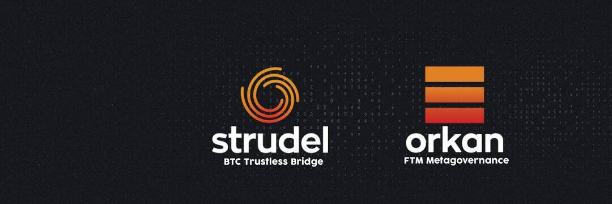

# Strudel DAO

馅饼
Strudel DAO 构建了第一个单向、无需信任的桥接协议，将比特币 (BTC)、比特币现金 (BCH) 和未来资产与 DeFi 连接起来。通过使用 Strudel 的安全协议，可以使用桥接、流动性挖掘、多链支持（以太坊、Polygon 和 BSC）和指数基金选项，并计划在不久的将来合并贷款和抵押选项。
Strudel 的主要价值主张之一是其 100% 无需信任的桥梁，这消除了对典型包装器中所见资产的保管控制的需要。 Harmony 的 Vitalik Buterin 和 Stephen Tse 都曾提到过无需信任的桥梁的重要性。
奥尔坎
Strudel DAO 最近在 Fantom 上推出了 Orkan。 Orkan 将作为 Fantom 生态系统内流动性流动的元治理协议。 Orkan 应该利用永续债券发行从 Fantom 上的那些项目中获取治理代币，这些项目采用流动性指标和锁定机制作为交易所激励措施。
Orkan 与标准欧姆分叉不同的一个方面是强调比特币的积累。通过债券控制 vBTC（Strudel 比特币）的供应。 vBTC (Strudel Bitcoin) 与 BTC 1:1 挂钩。最终目标将是永久钉住，在过度钉住时奖励代币持有者。

