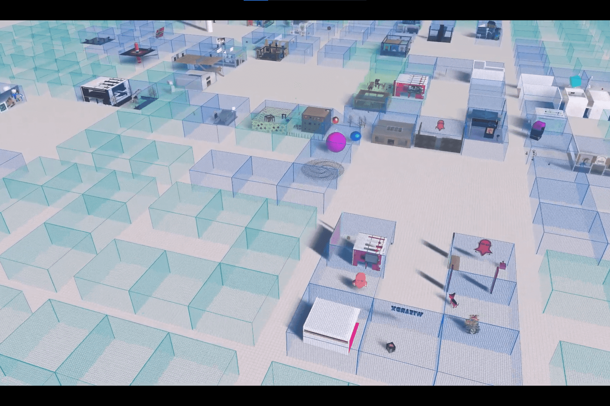

# Substrata

Substrata 是一个多用户网络空间/元宇宙。与其他用户聊天或探索其他用户创建的对象和地点。
您也可以创建一个免费的用户帐户并向世界添加对象！
Substrata 中的地块正在出售，可以铸造为以太坊 NFT。
Substrata 处于早期开发阶段，请期待粗糙的边缘！

+24.8% 胜率
了解幕后的权力动态，避免不合时宜的跟进并锁定比以往更多的交易。

30.2% 更短的周期
实时识别微妙的购买线索，抓住正确的时机，以减少 30.2% 的时间赢得交易。

减少 38% 的员工。周转
避免解雇、招聘和入职新交易撮合者的不断增加的成本

清晰度和控制
知道事情的真相。清楚并控制您的销售渠道。

