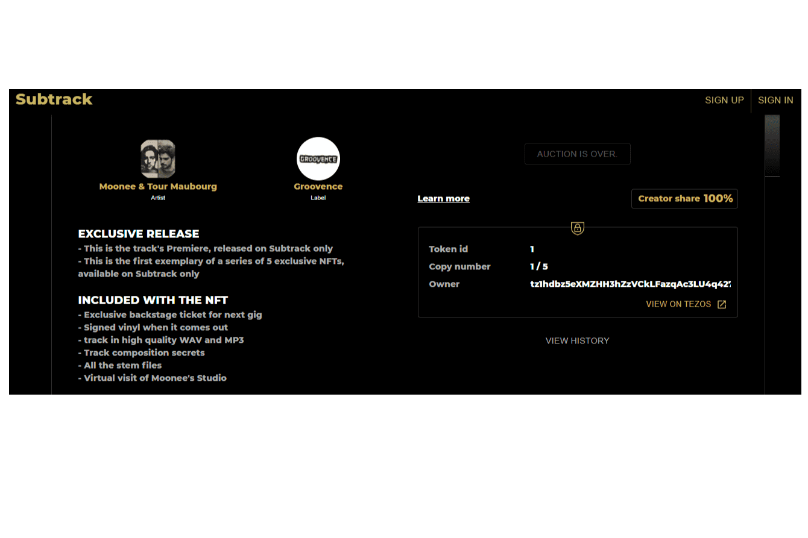

# Subtrack

Subtrack 是一个基于 Tezos 的 NFT 平台，致力于电子音乐。
它由 DJ（我自己）和技术迷于 2021 年 6 月创立。
我们希望像对待艺术一样对待音乐，并帮助有才华的艺术家从他们的热情中谋生，让他们能够为他们的粉丝提供独特的特权和引人入胜的体验。
我们使艺术家和唱片公司能够以 NFT 的形式发布其歌曲的收藏版，并使用它们为他们的粉丝提供独特的内容和特权。
粉丝可以对 NFT 进行投标，并赢得 NFT 以及随之而来的特权。
Subtrack 是一项新的 NFT 倡议，由当地法国电子音乐场景以及 Tezos 生态系统支持

