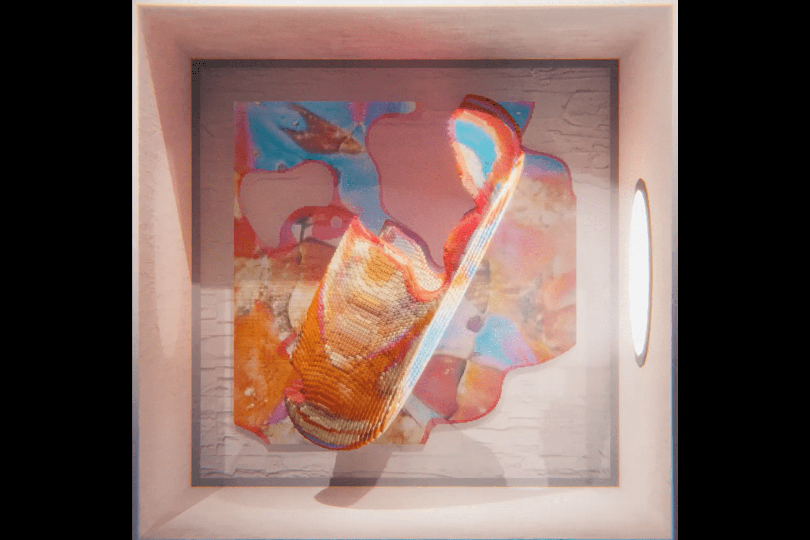

# -SUBTRACTION-

减法通常被认为是缺席或否定，一些东西从不给予，一些东西在应该存在的地方缺失。但这种情况并非如此。大多数物体由于缺乏空间而提供实用性，就像它们的物理属性一样，无论是内燃机中的空气、门上的开口还是杯子里的空隙。它也是计算机图形学和美术中的一种批判性方法，这种技术如此潜意识和生物学，我们通常不会直接识别它。因此，减法是ThankYouX 和 mpkoz 在他们最近的合作中的交汇点，在他们的技能和激情重叠中间的空洞形状。
GAN 接受了 10 多年的ThankYouX 绘画训练，为每种减法形式提供了独特且不可重复的中心纹理。所有其他行为和几何图形均由自定义生成软件按程序创建。许多特征和行为组合是可能的，进一步增强了每件作品的个性。然而，积极和消极力量的中心主题存在于一切之中。
由于自然和工业中的减法提供了效用，这些代币也将提供效用。他们将为持有者提供对未来ThankYouX 和mpkoz 项目的独家访问权——单独和协作、数字和实体。这仅仅是个开始。

