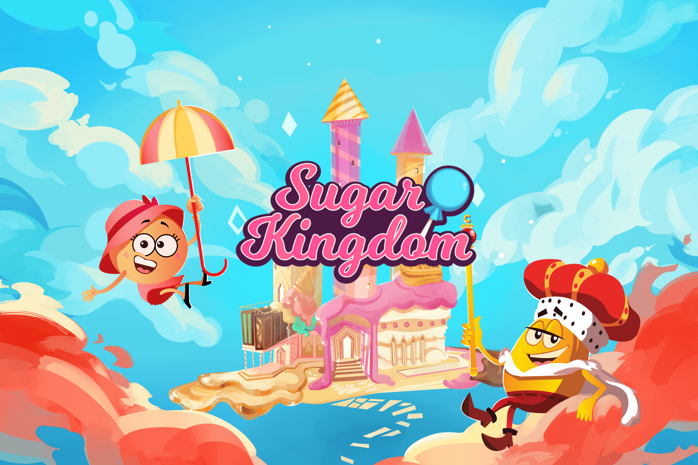

# Sugar Kingdom

Sugar Kingdom 不仅仅是区块链用户的游戏。但这是一款可以将区块链介绍给数百万玩家的游戏。
除了享受令人上瘾和身临其境的游戏玩法外，玩家是游戏内物品的真正拥有者，他们可以与其他玩家交换这些物品，并根据他们的总游戏时间获得真实、有吸引力和可观的奖励。之后，他们可以将这些收益投资于平台内共存的不同经济系统中。
这是一个既挑战区块链游戏，又挑战传统游戏的概念。
该游戏确保了一种熟悉、有趣和令人上瘾的体验，这已经得到了来自所有国家和所有年龄段的用户的验证。同时，它代表了一个独特的机会来探索新的金融机会，控制我们的资产并完全自由地管理它们。
如果数百万人喜欢糖果和巧克力，又有多少人会玩糖王国？

