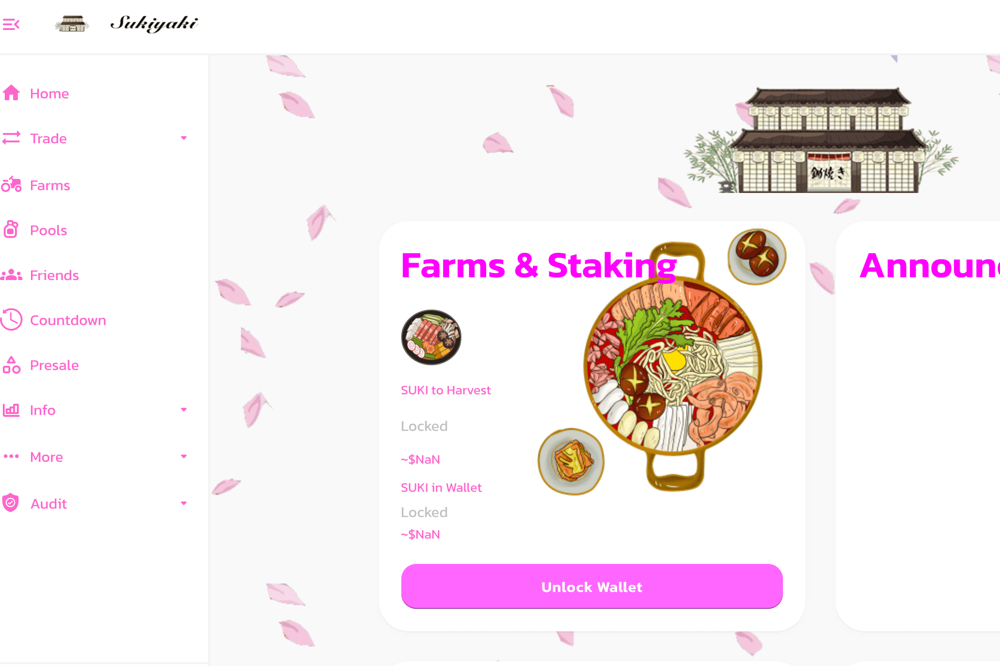

# Sukiyakiswap

Sukiyakiswap Finance (SUKI) 是具有通缩治理令牌模型的下一代自动做市 (AMM) 去中心化交易所。我们是您在币安智能链和 Pancakeswap 交易所上运行的首选收益农场，还有许多其他功能可以让您赚取代币。与当前第二代单产农场的浪潮一样，其目的是创建一个具有持续燃烧机制的永久通缩代币 SUKI，以创造一个能够维持长期收益和持续高 APR 以获得更大收益的环境。简单的视频显示我在 sukiyakiswap.finance 的 1 小时被动收入，因为价格上涨和下跌。

‌
