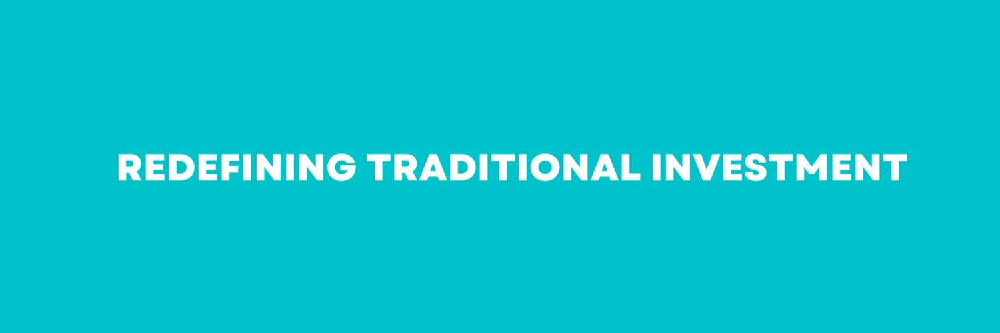

# SUMOTEX

多年来，传统私募股权 (PE) 公司的运营方式一直停滞不前。由于每股认购上限为 50,000 美元，并收取高额的 2-20 美元（2% 管理费和 20% 利润分享）费用，因此进入门槛很高。由于传统的营销措施，如电话推销、进行路演、获得机构资金，以及受地理位置的限制，他们在筹集/完成筹款方面遇到了困难。
房地产投资被视为非流动资产，由拥有最大资金的大型组织/PE公司控制和垄断。此外，对这些组织的信任度一直很低，因为投资者无法验证这些组织产生的收入和数据的真实性。
SUMOTEX 的团队认为是时候做出改变了，在传统私募股权公司的基础和基础上构建 SUMOTEX 代币。 SUMOTEX 是首家由区块链驱动的房地产私募股权公司，专注于从实体和虚拟世界中收集的收入中产生稳定的红利，以将价值返还给用户/持有者。未来房地产是去中心化的，而SUMOTEX走在了这方面的最前沿。>

