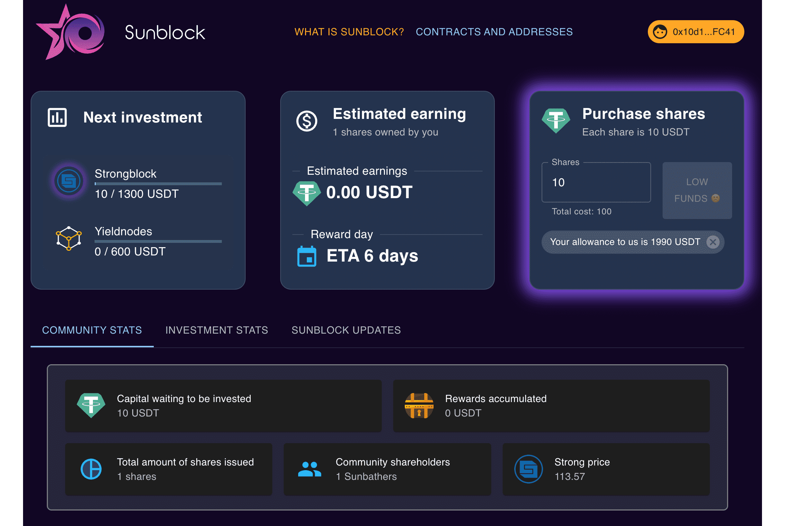

# Sunblock

Sunblock 是一种让资源有限的投资者能够投资于普通用户可能无法接触到的协议的方式。
它是如何工作的？
10USDT给你一股。把它想象成一个社区经营的储蓄账户。首先，作为一个社区，我们决定我们想要投资什么以及我们的目标金额应该是多少。它可以是任何东西，但最好是具有高进入门槛的东西。然后我们存入最低 10USDT 用于下一笔投资。
当达到目标金额时，Sunblock 将自动将资金转移到投资工具*。更多关于投资工具的信息如下。
然后将发送到投资工具的资金用于投资它要投资的目标投资，比如说 StrongBlock。这种车辆现在仅用于此目的，投资的回报直接返回车辆。
然后，按照固定时间表，所有车辆的奖励都由我们称为立方体的地方收集，然后分发给所有股东，也就是日光浴者。

