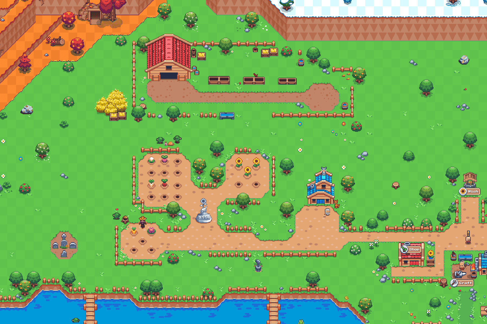

# Sunflower Land

在您建立自己的帝国并拥有向日葵土地令牌时，种植庄稼、砍树、开采岩石、制作物品并收集异国资源。
从您开采的黄金到您种植的葵花籽，一切都是多边形区块链上的可识别资源。
超过 150 种独特的代币可供收集和制作！
- 随着资源供应量的增加，价格会降低：这意味着早期的农民可以从他们的作物中获得更高的回报。

- 在朋友之间和交流中自由移动您的收藏品和资源。

- 每周越来越多的项目 > 150 多种资源和 NFT

- 制作限量版收藏品和具有游戏内提升功能的 NFT
  Sunflower Land 由一群热爱构建社区驱动项目的热情人士打造
  由全球 20 多名工程师和 30 多名设计师建造。我们认为 MetaVerse 应该由社区构建。 Sunflower Land 的目标是构建一个“即插即用”的 MetaVerse。游戏设计师、艺术家和开发人员可以推出自己的代币、NFT 并构建 Sunflower Land 的其余部分。

  

  
