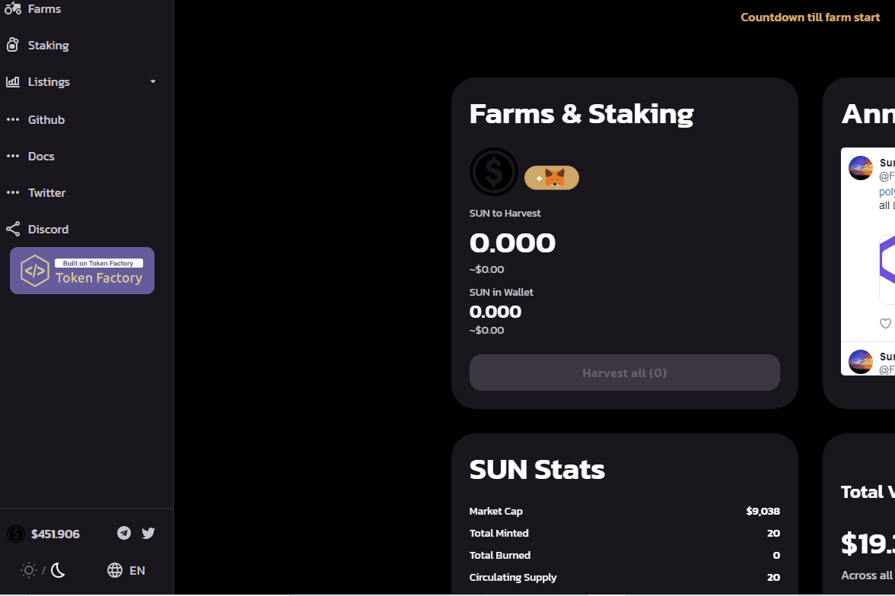

# SunsetCryptoFinance

Polygon 网络上的分层收益农场 10,000 的最大代币供应和每块 0.005 的排放率 最好的价格控制来看看我们吧！！！SunsetCryptoFinance 是一个去中心化的投资平台。它作为一个单产农场。 SunsetCryptoFinance 在 Polygon 区块链上运行。有10,000 ...日落加密金融。多边形。 / 去中心化金融。 1. — · 819. 对称。塞洛。 / 去中心化金融。 1. -90.91% · 820. TamagoSwap 金融。多边形。 / 去中心化金融。SunsetCryptoFinanceDefi,SunsetCryptoFinance百科介绍,592btc在全球Dapp上探索NFT、NFT市场、区块链游戏、De-Fi、区块链上的Dapp。

