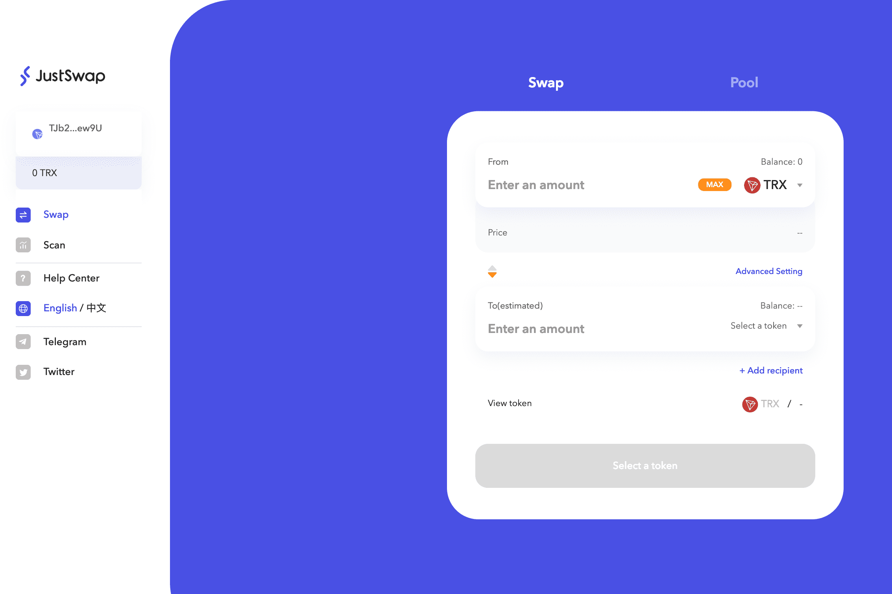

# SunSwap

SunSwap 是一种基于 TRON 的交易协议，用于 TRC20 代币之间的交易。根据系统价格，任何两个 TRC20 代币之间都可以轻松进行转换。收取的所有交易费用将直接流向协议的流动性提供者，而不是协议本身。SUNSWAP LTD - Companies House 提供的免费公司信息，包括注册办公地址、归档历史、账目、年度申报表、管理人员、费用、...Sunswap 提供了一种零排放、具有成本效益和智能的柴油运输制冷替代方案，具有能量预测、自适应电池的使用......

