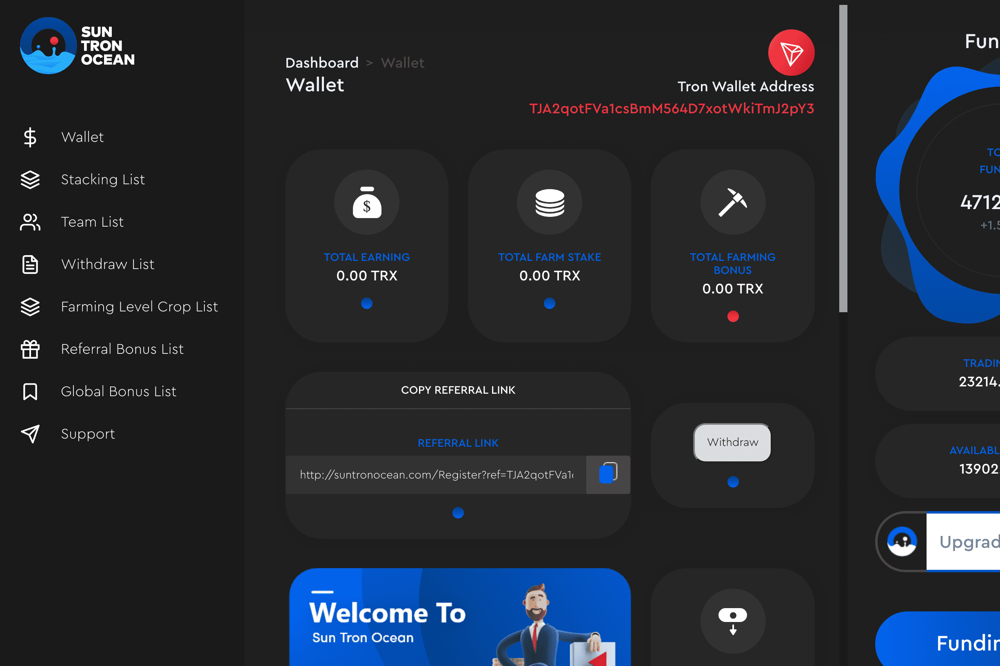

# SunTronOcean

Suntron Ocean 是一个用于加密知识和网络的去中心化智能合约平台，连接来自世界各地的人们，并提供无尽的发展机会。
通过 Tron 网络的智能合约，用户因扩大团队和增加 Suntron Ocean 成员的数量而获得相应的加密货币奖励。所有合约的代码以及 Tron 网络中的交易信息都是公开的SuntronOcean 是一个去中心化的智能合约平台，用于连接来自世界各地的人们的加密知识和网络。Suntron Ocean 是一个用于加密知识和网络的去中心化智能合约平台，它连接来自世界各地的人们并提供...

