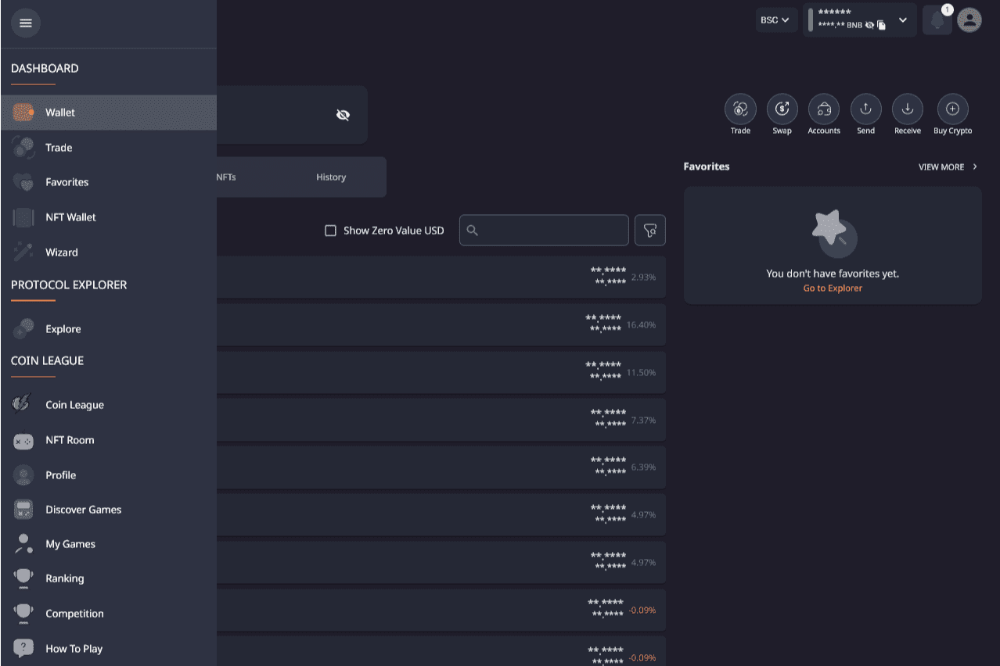

# SuperApp

DexKit 的 SuperApp 可以帮助用户以最有效的方式管理他们的加密资产，包括交易分析工具。用户将能够随时随地使用他们的电子邮件、Twitter、Discord 或 Google 凭据创建自己的 ERC-20 钱包，而无需下载另一个加密钱包或导入他们的种子。
SuperApp 非常适合那些在没有 Apple 或 Google 最新操作系统更新的情况下运行的低端设备。 SuperApp 的唯一要求是任何 .js 兼容的浏览器（使用 Opera Crypto 或 Brave 完美！）
最大兼容性：SuperApp 适用于任何 0x 兼容网络。用户可以添加他们喜欢的网络并从那里管理他们的资产。
在 SuperApp 中，用户还可以使用 Transak 安全插件购买加密货币并从那里开始他们的旅程。

