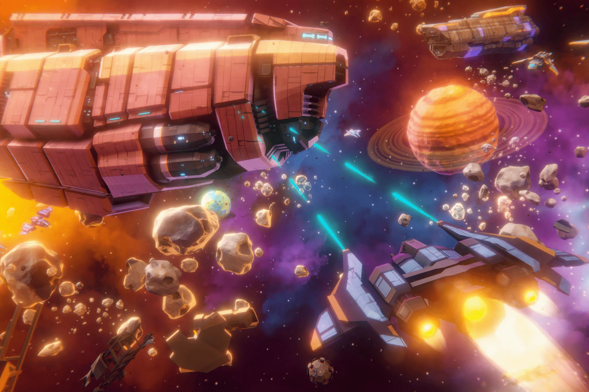

# Supernova

Supernova 是一款科幻沙盒生存 MMORPG，在开放世界中具有间接控制和开放经济，并通过游戏赚取机制！
从事许多游戏内职业，包括贸易、政治、战争、海盗和探索！
我们邀请您在任何平台（浏览器、移动设备、PC）上探索一个具有无限可能性的巨大开放世界。x 生存 MMORPG 在一个具有间接控制和开放经济的开放世界中，通过游戏赚取机制！
从事许多游戏内职业，包括贸易、政治、战争、海盗和探索！
我们邀请您在任何平台（浏览器、移动设备、PC）上探索一个拥有无限可能性的巨大开放世界。
开放世界
角色可以在空间站中醒来，穿上宇航服并冒险进入太空，捕获敌舰，降落在附近的星球上并继续探索地面基地——所有这些都是无缝且实时的。
性格独立
角色自动战斗，工作，飞船飞行，玩家发出一般命令。这消除了玩家的常规，并引起了人们对游戏中更重要的管理元素的关注。
开放经济
玩家将能够以法定货币购买游戏内代币，也可以将其兑换回来。玩家之间的交易、合作、武装冲突和其他社会经济关系不仅会带来身临其境的游戏玩法，还会带来赚钱的机会。
面向 UGC
Supernova-verse 对创作者开放。玩家可以制作自己独特的飞船设计、设备、太空和行星站、叙事冒险和其他内容，例如导入他们的 NFT，同时获得奖励。由于这种方法，游戏世界将收到定期和多元文化的更新。

