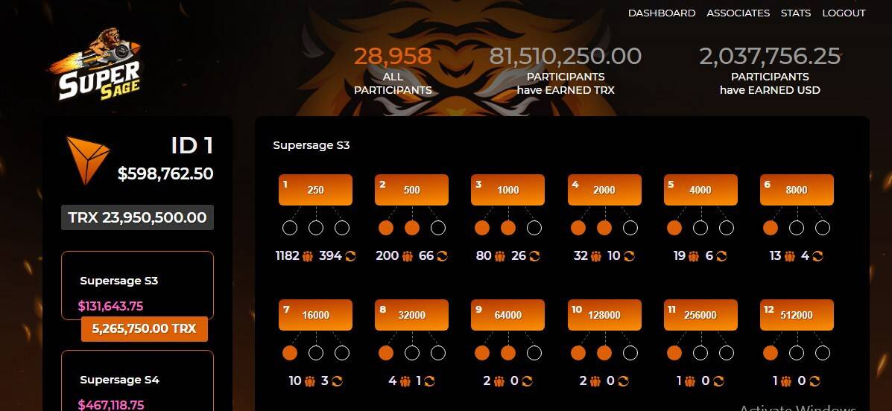

# SuperSage

100% 去中心化的网络和智能合约。
革命性的智能合约* 技术为去中心化市场参与者提供了直接参与个人和商业交易的能力。
SUPERSAGE 去中心化矩阵项目的智能合约是公开且永久可在 Tron 区块链上查看的。SuperSAGE 是基因表达序列分析 (SAGE) 技术的一种变体，它基于通过对短序列标签进行测序分析来计数转录本。SuperSAGE 是基因表达系列分析技术 (SAGE) 的最先进衍生产品，用于分析真核生物中表达的基因...

