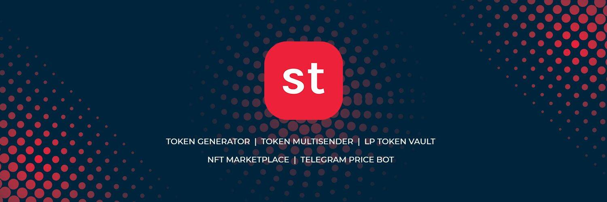

# SuperToken

SuperToken 是一种新的 DIY 代币生成器，可让您在 10 秒内创建经过气体优化、验证和审计的代币。只需输入代币名称、符号和代币总供应量，就会在您选择的区块链上生成一个全新的代币。 SuperToken 采用以客户为中心的用户界面设计，无需任何编码知识即可访问以创建、交易和共享代币。该平台稳定且透明，因为它是由具有多年区块链经验的开发人员使用区块链技术构建的智能合约。
您可以直接从 Metamask/Trust 浏览器铸币和部署代币。我们为铸造各种代币提供支持，包括标准代币、可铸造代币、可燃代币、稳定币、收益农业代币、变基代币、流动性代币、股息代币等。
在我们平台上创建的代币可以很容易地用于转账、空投、赏金和在交易所上市等。这些代币可以支持任何行业的用例并且是防黑客的。
SuperToken 平台还提供了一系列工具，包括 Token Multisender、Coin Multisender、AirDrops、Liquidity Lockers、Non-Fungible Tokens、智能合约审计等。

