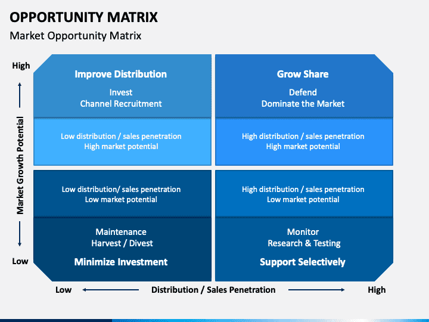

# Sustainable Opportunity Matrix

SOM 的构思和建立是为了响应具有真正透明性的代币的必要性。 一种对所有持有者都公平的代币，包括小鱼和鲸鱼。 一种代币，它为与区块链交互的任何人提供独一无二的机会。 具有现实世界支持的代币。 在其他举措不足的地方，SOM 试图实现这些基本概念，并影响加密空间以认真对待气候危机。 SOM 致力于以独家 NFT、通缩和反射代币经济学以及社区治理机会的形式为其持有者提供独特的奖励。

