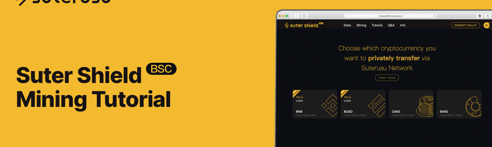

# Suter Shield BSC

Suter Shield BSC 是基于币安智能链的去中心化、二层交易和数据保护解决方案，同时也可以与以太坊、Heco 等其他智能合约平台集成。
它应用公钥同态加密来保护交易金额，并通过调用零知识证明在其他系统用户中隐藏交易的发送者和接收者的身份。换句话说，Suterusu 协议不仅为相关方提供匿名性，而且还提供交易机密性。
Suter Shield 允许交易的发送方任意选择机密交易的目标接收方，而无需事先与接收方共享任何秘密。因此，它不仅更加用户友好，而且还为适应更复杂的隐私保护 DeFi 功能（如 DEX、保险、贷款等）提供了基础。
此外，与其他同类解决方案相比，Suter Shield BSC 不仅方便了 BNB 和 BEP-20 代币的匿名和保密交易，而且是任何智能合约平台的更加模块化和通用的隐私保护解决方案。这就是为什么我们可以轻松地将我们的解决方案转换到其他平台，例如以太坊或 Heco。

