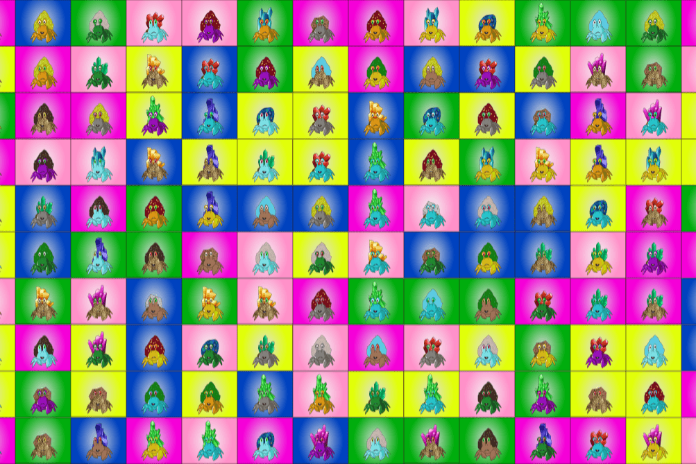

# Swamp Crabs

沼泽蟹是 777 只手工制作的螃蟹的集合，它们在索拉纳链上四处游荡，寻找宝藏。 采用沼泽螃蟹可以让您进入热带雨林和沼泽，并为创建强大的家园而战！
没有预售日期，螃蟹可以使用 phartom 钱包进行即时铸币，所有收藏品将在完整铸币后在二级市场上出售。Suter Shield和Tornado.Cash两个项目都致力于帮助用户在公开账本上实现资产和个人信息的隐私保护。Tornado.Cash启动挖矿后成功地实现了较大金额的TVL（目前价值约5亿美元的ETH和USDT），这使他成为加密领域巨鲸常用的隐私交易工具；但Suter Shield更希望基于自己的设计和开发为最大多数的用户提供隐私交易工具，成为Defi的基础，而这些用户恰恰现在正由于以太坊高额的Gas费而被Tornado.Cash所设定的最小金额和固定金额所拒之门外。

