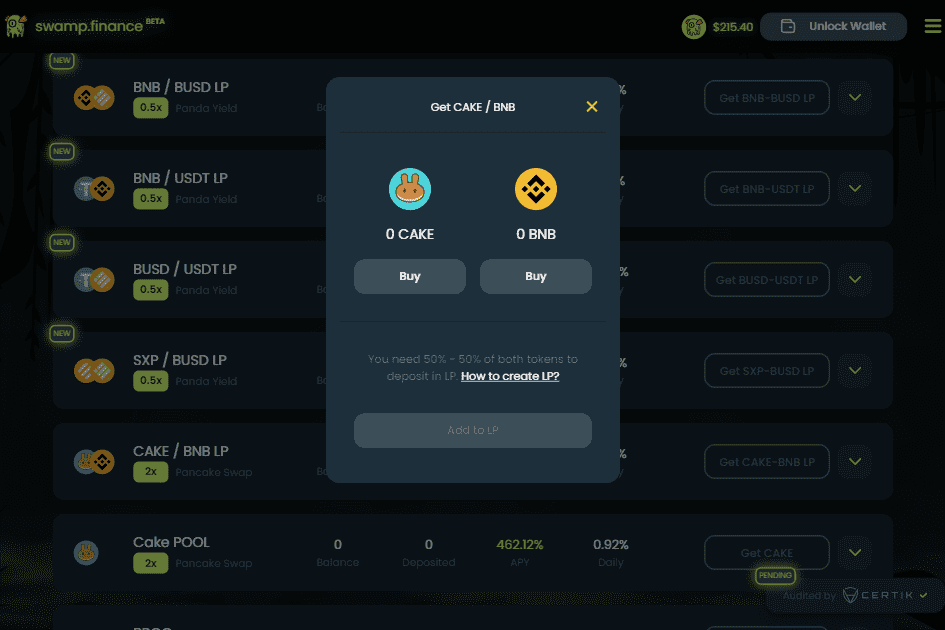

# Swamp Finance

关于沼泽金融？
Swamp Finance 是一个收益优化器，它为 SWAMPY 代币的持有者和用户提供收益聚合。为了促进单产农业和复利过程的自动化，沼泽金融使用保险库。保险库还可以更有效地利用天然气以及其他自动化流程，并使用不同的收益策略来帮助用户通过自动化增加资产。 Swamp Finance 有一个最优的复利策略和一个有效的定价模型，旨在鼓励长期的单产农业，并为长期持有者提供适当的激励。由于收益产生和复利过程中的自动化因素，用户无需手动将其质押奖励再投资，而只需将存款存入 Swamp 金融保险库即可依靠自动化资产增长。 SWAMPY 持有者也不需要对支持自动化和收益优化的底层协议有广泛的了解，而将资金存入金库是一种被动的投资策略。目标是增加用户存入资产的初始价值，类似于加密对冲基金的运作方式，而对用户端的参与最少。

