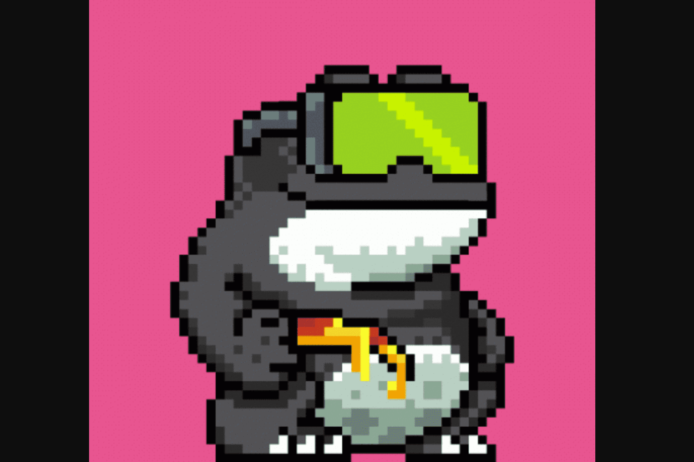

# Swampverse

为了拯救稀有的沼泽种族，创世纪蟾蜍的任务是寻找一个新的地方定居并称之为家。 在经历了永恒的漫游和浏览宇宙之后，创世纪蟾蜍发现了一片废弃的沼泽，有足够的潜力支持沼泽种族的未来。 这片令人叹为观止的沼泽地将永远被称为沼泽宇宙。 一片沼泽，与宇宙中的任何其他地方都不一样，拥有丰富的绿色植物、饱和的土壤和广阔的进化环境。 有了家庭安全，Genesis 将他们的 DNA 与剩余的 !vibe 战略性地结合起来，生产出第一代和最后一代 9600 只独特的 Swampverse 蟾蜍。 每只蟾蜍都会过上自己的生活，但它们将作为一个社区共同繁荣。

