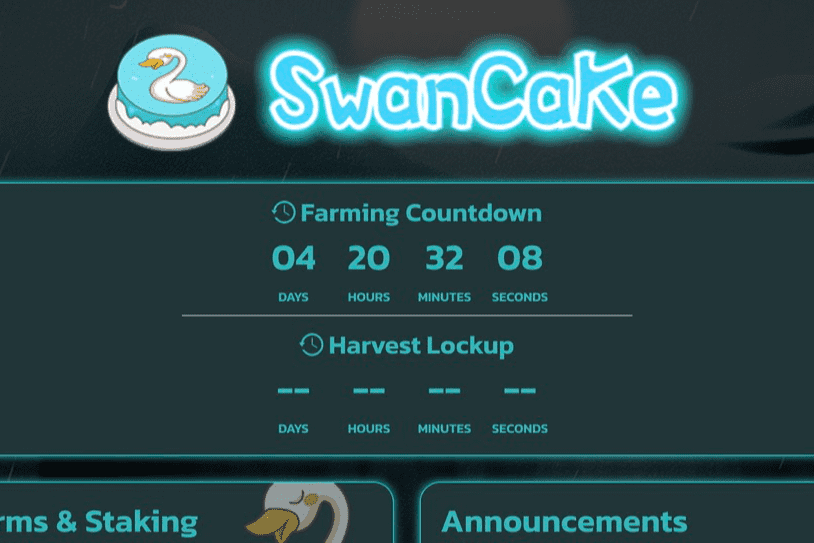

# SwanCake Finance

SwanCake 是运行在币安智能链上的最新一代 Yield Farm 和 AMM 去中心化交易所，具有许多独特和创造性的功能。我们的灵感来自于长期的收获锁定，但我们可以更好地进行收获锁定。wanCake Finance 是一个收益农业协议。 它由 BSC 网络提供支持。 农场的原生代币是 SW以及触手可及的最重要的 SwanCake Finance dApp 指标 - 分析下面的深度图表，评估 dApp 在不同时间段的活动并做出快速、准确的决策！AN。 它可以通过质押 LP 代币或 SWAN 代币本身来获得。 此外，由于 SwanCake Finance 提供 DEX，它允许用户使用该平台交换代币。

