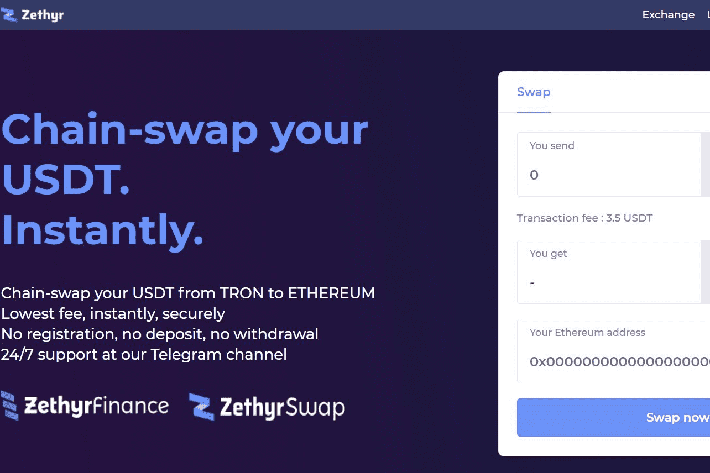

# Swap USDT

将您的 USDT 从 TRON 链交换到 ETHEREUM 最低费用，即时，安全 无需注册，无需存款，无需提款以 USDT 为保证金的永续合约是一种线性合约，保证金存储在 USDT 稳定币中。 另一方面，硬币保证金永续掉期（也称为反向永续掉期）将保证金存储在选定的加密货币中，例如 比特币 (BTC)、以太 (ETH)、XRP 等。随着新投资者在创新领域占据一席之地，加密货币市场正在飙升。 随着价格和价值的上涨，加密货币交易所等虚拟资产服务提供商正在构建更多的金融工具和产品，以吸引加密货币交易者的兴趣。

火币加密货币交易所成立于 2013 年，是向用户提供各种工具的先驱之一。 在过去几年中，该交易所扩展了其以加密货币为重点的金融产品——增加了其大量的数字资产现货交易产品。 加密领域的衍生产品与市场同步膨胀，火币一直在努力增加尽可能多的此类产品。 火币期货是火币集团旗下的衍生品平台。

