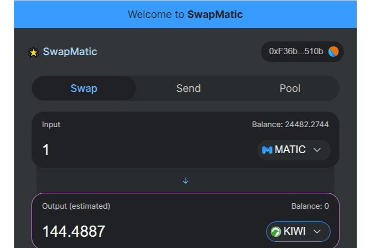

# SwapMatic

SwapMatic 是 100% 去中心化的服务。 任何人 - 可以创建交易所 - 添加或删除流动性 - 获得 0.3% 的池奖励 - 利用现有的流动性池 - 围绕核心工厂合约开发总能从市场中找到最优惠价格的交换聚合器。 通过质押或汇集 $SWAM 来赚取奖励。 保证 APY 25-200%。强烈建议从 http://Swapdog.io https://v1.swapmatic.io/swap 和其他池中提取您的 SWAM 和其他代币，并以 250% 的年利率存入 blocktimeworld。等待 $SWAM 代币的 BURN-n-SWAP 公告。提取您的 $SWAM自 2020 年起，旧版 SwapMatic (v1) 即 http://Swapdog.io 将不再作为一项专用服务。 旧版 UI 可在 https://v1.swapmatic.io 中找到 矿工请使用矿池选项卡提取您的资金。

