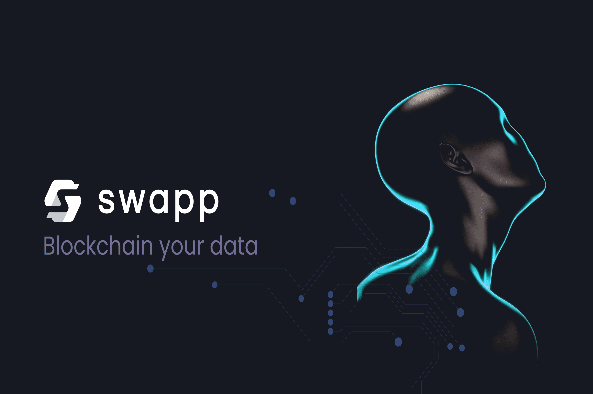

# SWAPP Protocol

SWAPP 正在使每个人都可以控制自己的数据。这对人们有好处，因为他们将处于控制之中。我们正在通过使用区块链来改变数据公司的工作方式，使其变得更好、更安全。随着越来越多的人开始使用它，代币的价格会上涨，让他们有钱购买他们想要的东西。 SWAPP 是一种销售数据的新方式。它将权力掌握在您的手中。您可以对有权访问您数据的人说“不”或“是”。想要您的数据、向您展示广告、使用您的数据进行重新定位活动的公司必须为此付费。
SWAPP 协议是一种多链智能合约，已在以太坊（ERC-20）和币安智能链（BEP-20）上推出。
SWAPP 是一种去中心化、公平推出的 ETH 和 BNB 配对实用代币，用于促进 SWAPP DeFi 平台中的收益耕作奖励，并作为 SWAPP 智能手机应用程序和浏览器扩展中的奖励形式。
- DeFi 启动 - SWAPP 的最初目的是创建一个繁荣的 DeFi 生态系统，由可以参与各种形式的收益耕作的代币持有者组成，他们最终将成为即将到来的创始用户
  SWAPP 移动应用程序。

- SWAPP 移动应用程序 - 推出后续 SWAPP 移动应用程序后，用户将享受强大的新功能，包括统包数据货币化和增强隐私功能。
  哪里可以买到SWAPP？
  SWAPP 可以在 UniSwap 和 PancakeSwap 去中心化交易所购买。目前，ERC-20 版本的代币可以在 Swapp 上进行质押。我们正在努力推出更多的跨链池，用于质押 BEP-20 和其他即将推出的链。

  
