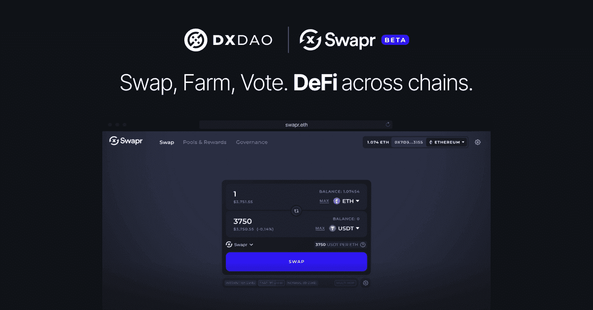

# Swapr

Swapr 是一个多链 AMM，具有一套独特的功能，包括 LP 治理、DIY 农业等等。 Swapr 是第一个允许通过治理调整掉期费用的自动做市商 (AMM)，并且已在 DXdao 社区内有机地开发。 Swapr 标志着 DAO 首次在以太坊上推出 DeFi 协议。 DXdao 推出了 SWPR 代币，以吸引和发展一个参与社区来管理 Swapr 的未来。 此次发布是 DXdao 社区和 Swapr 团队之间数月工作的结晶。 SWPR 代币的推出恰逢 ArbitrumOne 的推出，这是 Swapr 上线的第三个网络。 Swapr 协议将由 SWPR 代币持有者通过 ERC20 公会结构管理，其中代币被锁定以进行投票。

