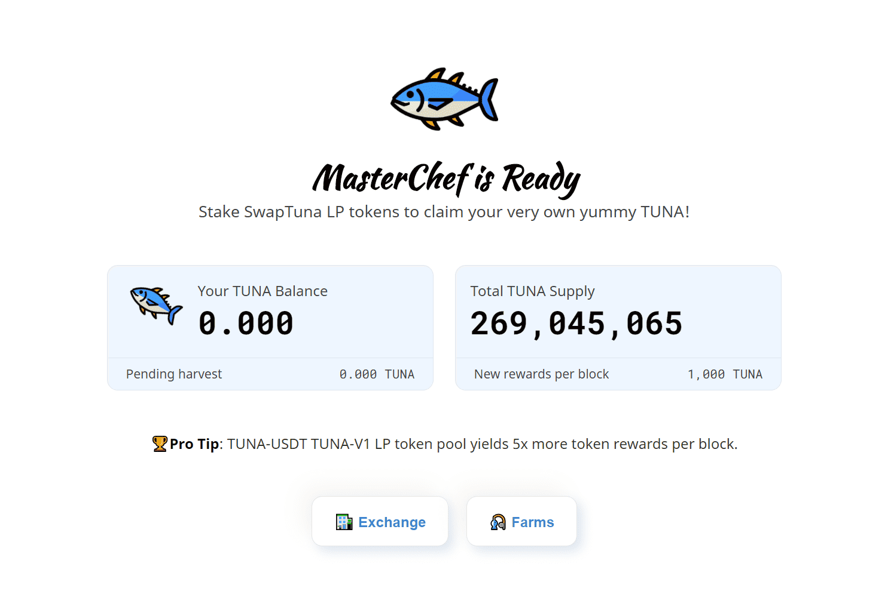

# SwapTuna

TunaSwap 是一个基于币安智能链的新项目，由 SushiSwap 创新。 它有两部分，金枪鱼农场（Tuna Farm）和 Swap（去中心化交易所）。 与其他类型的 SushiSwap 产品一样，TunaSwap 采用自动做市商（AMM）的模式。
与 SushiSwap 一样，TunaSwap 每次将其资金的 10% 分配给创始团队，用于开发、未来迭代、审计等。
在 TunaSwap 中，用户在获得费用奖励的同时，也可以使用他们的 LP 代币在 Tuna Farm 中赚取 TUNA 代币。 后来，即使他们移除了流动性，他们仍然持有 TUNA 代币，可以通过质押来赚取更多的 TUNA（来自 Tuna Warehouse，为所有 TUNA 持有者保留 1/6 费用）。 Tuna 代币作为他们对平台贡献的“证明”。

