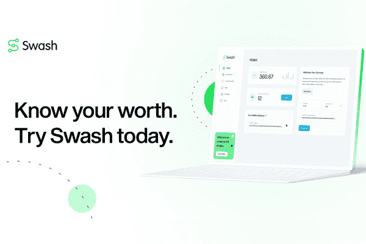

# Swash

Swash 是一个由工具和服务组成的生态系统，它使人们、企业和开发人员能够通过汇集、安全共享数据并将其价值货币化来释放数据的潜在价值。
人们分享他们的数据以赚取收入，同时保留他们的隐私。 企业以可持续和合规的方式访问高质量的零方数据。 开发人员可以轻松地在协作开发框架内设置和构建系统。
作为世界领先的数据联盟，Swash 正在重新构想数据所有权，让数据经济的所有参与者都能在流动的数据数字生态系统中获得、访问、构建和协作。

