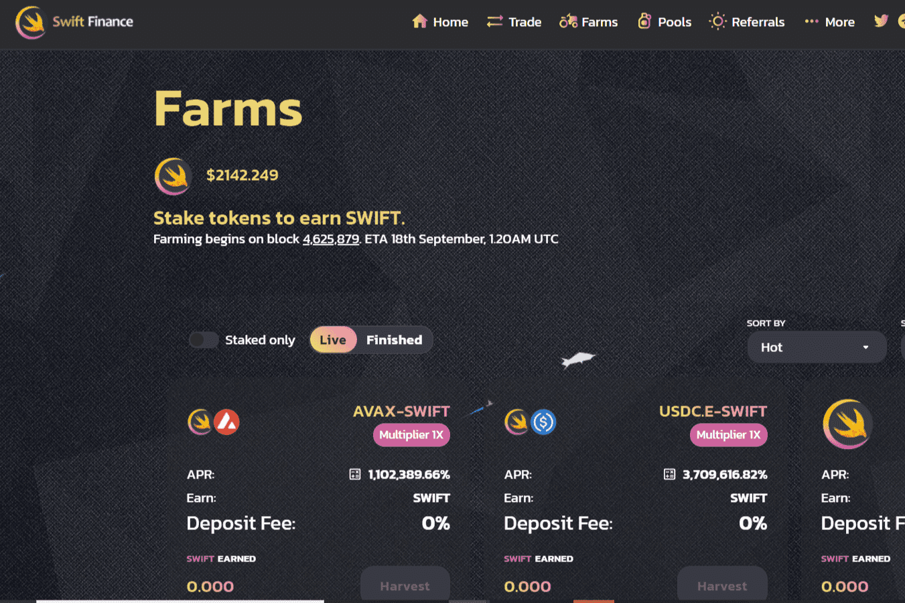

# Swift Finance

Swift Finance 是一个基于 Avalanche 网络的收益农场，它实现了我们独特的“APR 重置”功能。
基本上，每周，收益农场都会不断地将其三个“农场”与社区将投票支持的其他“农场”轮换。
这为 Swift Finance 上的单产农民提供了更多权力，而不会一次又一次地被束缚在同一个农场。具有 APR 重置功能的任何链上唯一的收益农场！ 在雪崩上启动！“APR Reset”概念的原始先驱，现在正在METIS上推出我们的V2！

我们从 v1 中吸取了教训和失败，并实施了更多的销毁机制！

