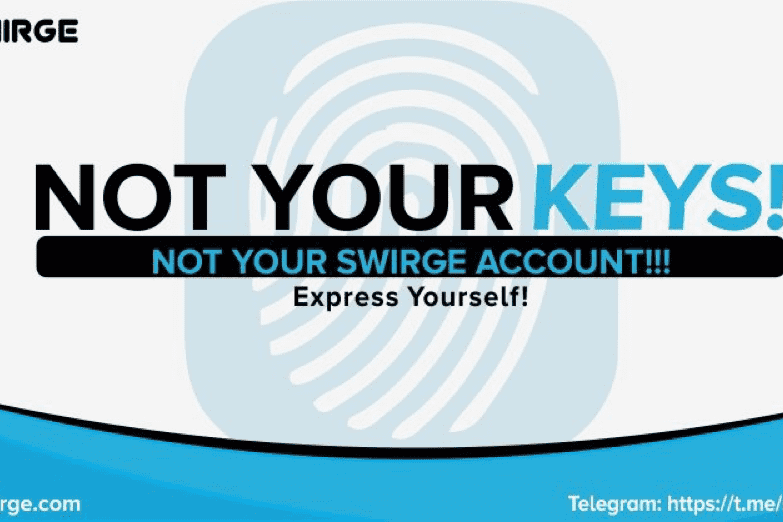

# Swirge

简而言之，摇摆
Swirge 的生态系统包含一个去中心化的社交媒体、一个去中心化的金融系统，以及一个建立在币安智能链和 Matic 网络上的市场。
Swirge 是一个以用户为中心的平台，以用户为中心。首先，保护用户的数据和信息，让他们完全控制自己的数据。其次，赋予用户通过社交创造财富的权力和掌控自己财务的机会。
Swirge 解决方案提供了一个用户友好的平台，没有任何限制、费用，并且完全免费使用。它由币安智能链和 Matic 网络上的社区构建并为社区构建。
当前主要特点
（所有在一个应用程序中）
1.) 完全去中心化
Swirge 无缝集成了一个去中心化的市场，以在平台上实现安全、快速的点对点买卖。与去中心化支付平台一起，在平台内实现快速、廉价和安全的交易。
Swirge 平台是完全去中心化的，您所有的 Swerve（帖子）都存储在去中心化的区块链上。
2.) Swirge 社交媒体
Swirge social 是一个建立在区块链上的去中心化社交媒体平台，具有大多数现有传统社交媒体平台的所有功能和 Swirge 独有的新功能。用户处于控制之中
与传统的现有平台不同，Swirge 旨在让用户完全控制他们的数据、隐私和财务。
3.) Swirge 支付
SwirgePay 是一个建立在区块链上的去中心化金融协议，可以完全去中心化金融的各个方面，从交易所、数字资产的买卖、汇款、在线购买到保险。 SwirgePay 赋予用户不受管辖权限制的控制财务的权力。

