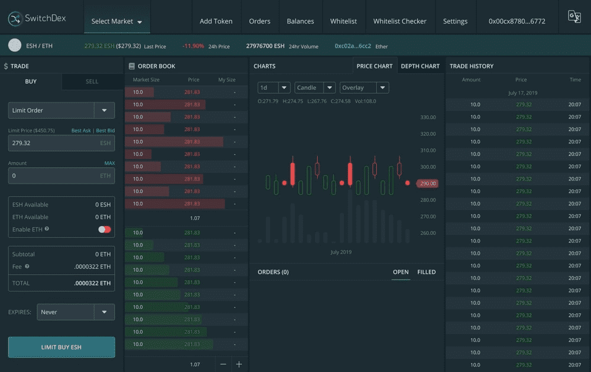

# SwitchDex

SwitchDex 是运行在以太坊区块链上的去中心化交易所。这个项目是从 veridex 分叉出来的，它的目标是成为最完整的基于 0x 的开源 dex。

这个 repo 附带一个 ERC-20 代币交易界面和一个 ERC-721 市场界面。

要使用此分叉，需要执行以下操作：

成对添加 ESH、SDEX、DESH 和 0x
让我们知道您正在使用此分叉
添加 Powered by 0x 和 Switch
请勿使用与此代码关联的另一个池，而不是使用以下代码：Veridex 池。 如果您是做市商，您可以在 Join as Maker 加入 Veridex 市场池

