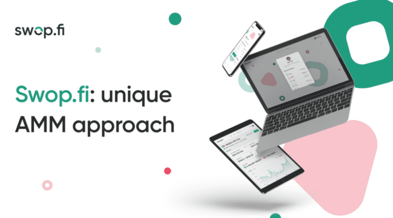

# Swop.fi

猛扑。fi是一家自动做市商（AMM），提供最适合每个特定令牌对的不同定价公式。最初的扁平公式旨在减少与同一法定货币挂钩的一对稳定硬币的滑动。经典的常积做市商公式用于其他对。
猛扑。金融机构持有一部分资金池的流动性，每日支付包括在资金池中，除了交易费用外，还为流动性提供商的收入增加了5-50%的APY。猛扑。fi还通过SWOP（协议的治理令牌）奖励流动性提供商。
猛扑。fi基于Waves区块链，确保交易可以在几秒钟内添加到区块链，智能合约调用的网络费用仅为0.005 Waves（几美分）。

