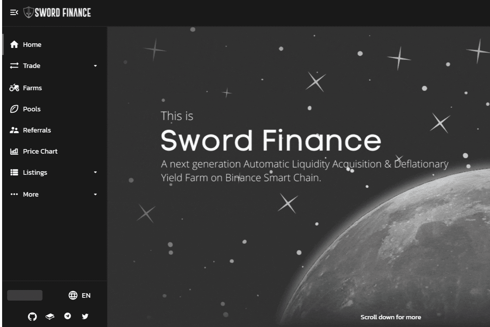

# Sword Finance

Sword Finance 是一个在 BSC 上运行的去中心化交易所。 其革命性的功能为您提供与众不同的农业体验，您将获得一致、可持续的高回报。
‌我们厌倦了启动农场的项目，价格立即降至 0 美元。 因此，我们实施了诸如软上限和分层农业等特殊功能，这将使我们的原生代币 $SWORD 极具价值，并且对持有和质押非常有益。 这将确保价格保持稳定或上涨，因为持有 $SWORD 代币会随着我们层的推出而带来惊人的回报。

