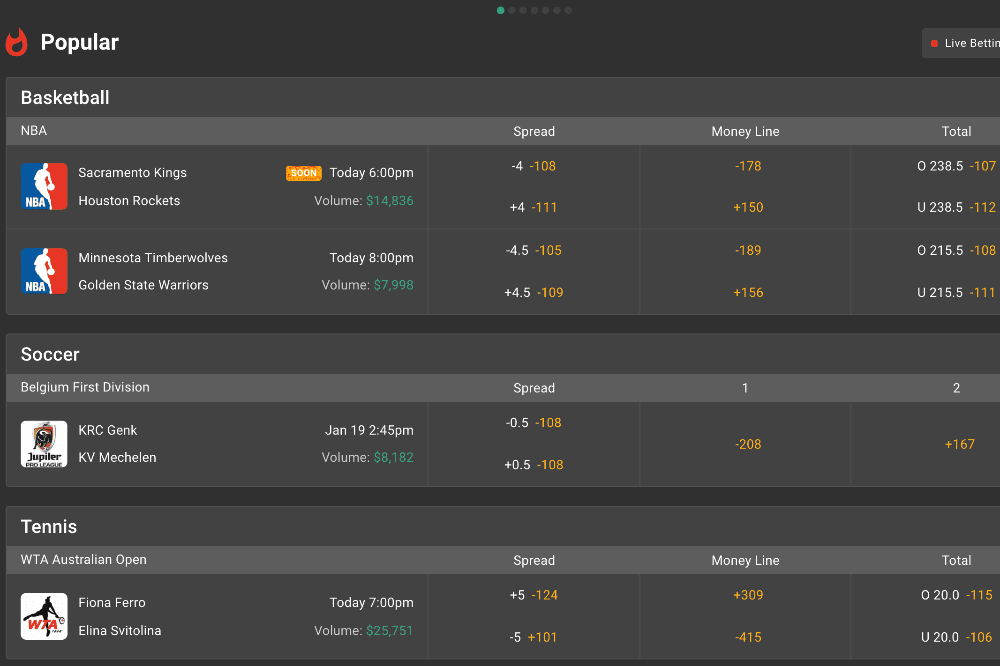

# SX.Bet

SX.Bet 是全球交易量和用户量最大的基于区块链的体育博彩平台。
自成立以来，截至 2022 年 4 月，SX.Bet 已处理超过 1,000,000 次独特投注，投注额总计超过 170,000,000 美元。
加密货币投注者始终选择 SX.Bet，因为它是最具流动性、最安全的，并且在整个区块链体育博彩领域提供最好的促销活动。最重要的是，SX.Bet首创“Bet挖矿”；每次您在 SX.Bet 上下注时，您都可以获得 $SX 代币！然后，您可以质押 SX 以获得奖励、参与治理并获得费用折扣。
SX.Bet 也是 SX 世界巡回赛的举办地，这是一系列在 SX.Bet 上举办的投注锦标赛，奖金池高达 50,000 美元 DAI。每周都有新的锦标赛，因此您总能确保获得大量奖品。 SX.Bet 还为加入该平台的每位新投注者提供 1,000 美元的投注积分，非常丰厚的欢迎奖金。
用户可以通过自己的 MetaMask 或电子邮件钱包的安全性投注 USDC 或 ETH。 SX.Bet 是一个交易所，因此用户可以成为博彩公司并在交易所提供自己的赔率或接受其他用户现有的报价。 SX.Bet 在大多数主要联赛中拥有超过 20 项体育赛事，以及大量专业投注类型，是基于区块链的投注者的投注场所。

