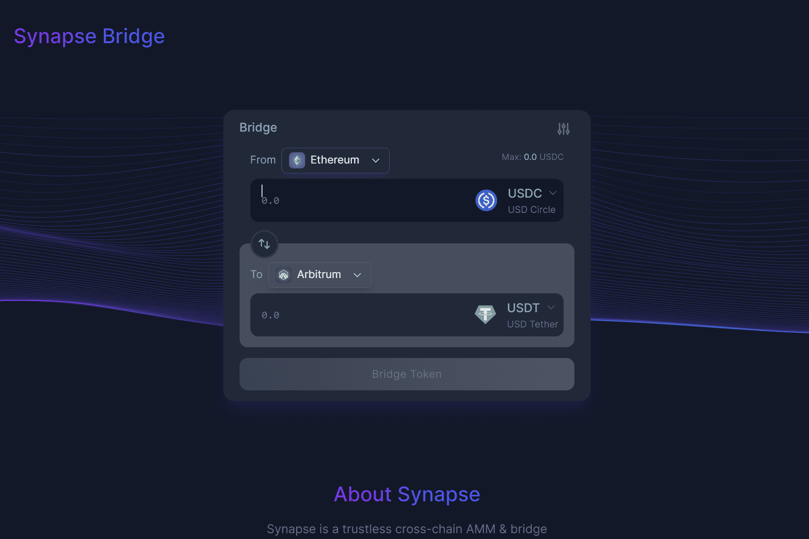

# Synapse

Synapse 网络由使用阈值签名方案 (TSS) 运行的跨链多方计算 (MPC) 验证器保护。 该网络是无领导的，每个验证者在接收到 MPC 验证者组跟踪的各种链上的链上事件时运行相同的进程来维护安全性。 一旦三分之二的验证者使用自己的个人密钥集体签署了同一笔交易，网络就会达成共识并向目标链发出交易。Synapse 是一种跨链层 ∞ 协议，支持区块链之间的无摩擦互操作性。该数据代表被跟踪智能合约的原始链上活动

