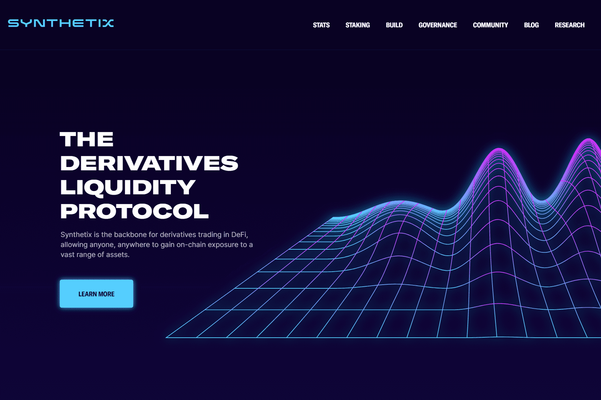

# Synthetix

Synthetix 是以太坊上的一个去中心化平台，用于创建 Synths：跟踪现实世界资产价值的链上合成资产。 Synthetix 作为稳定币项目 Havven 诞生，于 2019 年 2 月在主网上推出之前更名并扩大了其范围。截至 2019 年 5 月，Synthetix 平台支持代表法定货币、商品（例如黄金）和加密资产的 20 多种 Synth。 股票、指数和其他衍生品预计将很快加入。一种新的金融原语，可以创建合成资产，提供独特的衍生品和区块链上的真实资产敞口.这意味着更多的 DEX 交易者将自动通过 Synthetix 的深度流动性和低费用为他们提供最好的 DeFi 填充。

