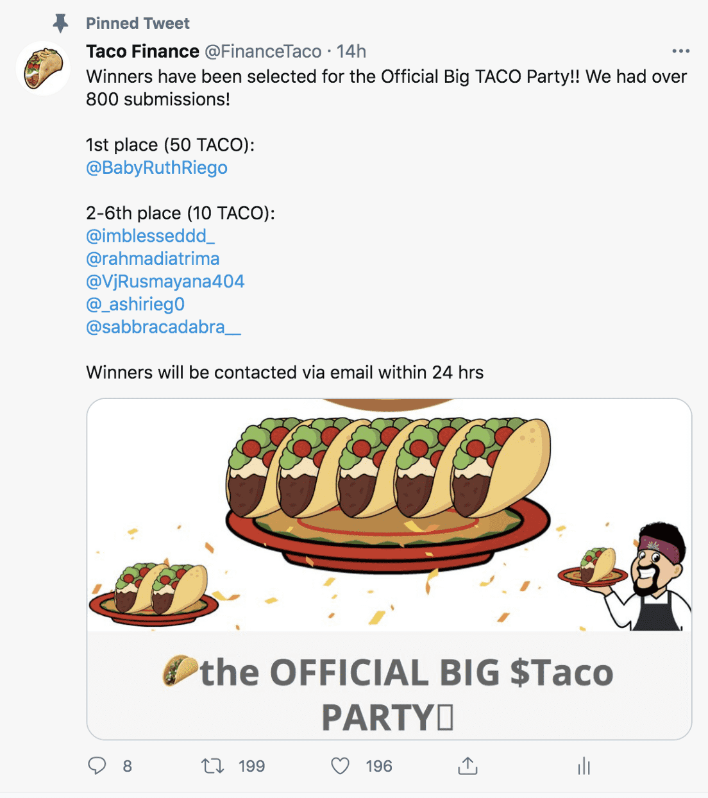

# Taco Finance

DeFi 最热门的趋势 Yield Farming 回归币安智能链（BSC）！ 然而，这一次，它以更低的交易费用和更快的速度回归。

Taco Finance ($TACO) 是新一代自动做市商 (AMM) 的一部分，具有许多新功能。 其中包括通货紧缩治理代币模型，具有独特的销毁、回报和盈利的收益，以及在发布时的时间锁定合约，以避免地毯拉动。 这个在 BSC 上运行的去中心化交易所是最以社区为中心的项目，提供美味的 taco 奖励。
我们的目标是为人们提供一个更安全、更可持续的农场生产环境。 今天就来看看吧！

